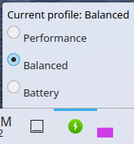

# System76 Power KDE

KDE plasmoid to control the power profile of the system76-power daemon.



## Install

Installing requires C++ build and some system dependencies:

### Build libraries

The set of required libraries in KUbuntu to build this plasmoid is:
- `extra-cmake-modules` - this contains the CMake build scripts for KDE.
- `qtbase5-dev` - the base QT5 development libraries.
- `qtdeclarative5-dev` - the QT5 QML development libraries (to export the native QML plugin to the plasmoid itself).
- `libkf5plasma-dev` - this contains the CMake tools to build and install plasmoids.

### Build tools

Additionally, the following tools are required to build:
- `make` or `ninja-build` - the build system.
- `cmake` - the build generator used in all KDE software.
- `g++` - the actual C++ compiler.

### Debug

To debug this plasmoid, use `plasmoidviewer` from `plasma-sdk`.

### Building and installing

To build and install the plasmoid, run the following:
```shell
mkdir cmake-build-release
cd cmake-build-release
cmake .. -DCMAKE_BUILD_TYPE=Release
sudo make install
```
- You can now find the new "System76 Power" plasmoid in KDE widget selector.

To build the plasmoid for debugging, run the following:
```shell
mkdir cmake-build-debug
cd cmake-build-release
cmake .. -DCMAKE_INSTALL_PREFIX=$PWD/install
make
make install
```
- To run the plasmoid in this configuration, the easiest way is through `pasmoidviewer`.

## Use

To use the plasmoid once installed, add it to one of your KDE panels.
The plasmoid shows itself as a small power icon. The power profile can be changed after opening the plasmoid.
